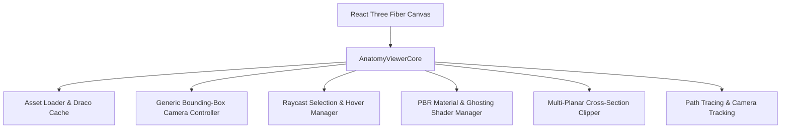

# Shared 3D Anatomy Engine Architecture (AnatomyViewerCore)

## 1. Architectural Principles

`AnatomyViewerCore` is the centralized 3D rendering and interaction engine powering all MedAnatomy viewports (Whole-Body, Deep Specimen, and Craniofacial / RHM Labs).

## 2. Core Responsibilities

1. **Unified Asset Ingestion & Normalization**:
   - Asynchronous streaming of GLTF/GLB models using Three.js `GLTFLoader`, `DRACOLoader`, and `MeshoptDecoder`.
   - Node traversal and automatic injection of `userData.anatomyId` based on canonical mappings.
   - Preservation of original mesh matrices while providing normalized world coordinate scaling.

2. **Generic Camera Framing (No Hardcoded Positions)**:
   - Compute exact 3D bounding boxes (`THREE.Box3`) and bounding spheres (`THREE.Sphere`) for any selected anatomical entity or group of entities.
   - Dynamically compute camera distance:
     $$d = \frac{r}{\sin(\text{FOV} / 2)} \times \text{marginMultiplier}$$
   - Smoothly interpolate camera position and orbit controls target via spherical lerp (slerp).

3. **Multi-Mode Raycasting & Selection**:
   - Perform raycasting with precision thresholds adapted for thin nerves and vessels.
   - Highlight selected structures with emissive pulse materials.
   - Non-selected structures transition to a ghosted x-ray silhouette (opacity 0.15, transmission 0.85, depthWrite true).

4. **Multi-Planar Slicing Engine**:
   - Global and local `THREE.Plane` clipping planes for Axial (XY), Sagittal (YZ), and Coronal (XZ) cross-sections.
   - Stencil buffer caps for solid anatomical interior rendering.

5. **Measurement Caliper**:
   - Real-world millimeter 3D measurement using vertex snapping and Euclidean distance computation.
