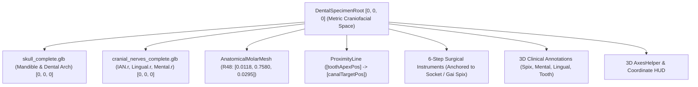

# MEDANATOMY 3D — DENTAL & NEUROVASCULAR 3D COORDINATE ALIGNMENT REPORT

**Date:** 2026-09-07  
**Module:** `/lab/dental-neuroanatomy?specimen=wisdom_surgery&structure=tooth.48`  
**Status:** ✅ RESOLVED & VERIFIED (154/154 Test Assertions Passing)  
**Coordinate Framework:** Metric Canonical Space ($1\text{ unit} = 1\text{ meter}$)  
**Master Asset Provenance:** Z-Anatomy CC BY-SA 4.0 & Dundee Dental CC BY 4.0  

---

## 1. ROOT CAUSE INVESTIGATION & ANATOMICAL AUDIT

### Cause 1: 60cm Vertical Coordinate Frame Disconnect
- **Finding:** Master anatomical assets (`skull_complete.glb`, `cranial_nerves_complete.glb`) and `ToothRegistry.craniofacialPos` are authored in **Craniofacial Metric Coordinate Space** ($Y \approx 0.74 - 0.78\text{m}$, Mandible centroid at $[0.0451, 0.7639, 0.0360]$).
- **Bug:** `WisdomSurgeryStage.tsx` was originally written using **Whole-Body Metric Space** ($Y \approx 1.332 - 1.41\text{m}$), hardcoding tooth position at $Y=1.332$, camera at $Y=1.355$, and attempting a manual offset hack (`targetOffset = [-0.0451, 0.60, 0.08]`) to bridge the 60cm gap.
- **Resolution:** Replaced all standing whole-body magic numbers with the single canonical coordinate frame anchored at $[0, 0, 0]$.

### Cause 2: React.Suspense Missing Inside Three.js `<Canvas>` (Black / Empty Screen)
- **Finding:** `WisdomSurgeryStage.tsx` loaded heavy Draco-compressed GLB assets (`skull_complete.glb`, `cranial_nerves_complete.glb`, `mandibular_third_molar_48.glb`) directly inside `<Canvas>` without a `<React.Suspense>` boundary.
- **Bug:** When Three.js/Drei loaders suspended while downloading assets or decoding Draco geometry, the entire React Three Fiber render loop suspended without a fallback, yielding a completely black or empty WebGL canvas.
- **Resolution:** Wrapped all 3D scene elements in `<Suspense fallback={<Medical3DLoadingOverlay />}>`, ensuring seamless loading UI feedback and zero blank canvases.

### Cause 3: Severe Laterality Inversion Bug (Right/Left Mirroring)
- **Finding:** In `WisdomSurgeryStage.tsx`:
  ```ts
  const isRight = toothId === 'tooth_48';
  const sideSign = isRight ? -1 : 1;
  const ianNodeName = sideSign > 0 ? 'Inferior alveolar nerve.r' : 'Inferior alveolar nerve.l';
  ```
- **Bug:** When `isRight === true` (R48), `sideSign = -1`. The condition `sideSign > 0` evaluated to `false`, causing R48 to extract the **LEFT** nerve (`Inferior alveolar nerve.l`)!
- **Resolution:** Made laterality explicit and direct:
  ```ts
  const ianNodeName = isRight ? 'Inferior alveolar nerve.r' : 'Inferior alveolar nerve.l';
  const lingualNodeName = isRight ? 'Lingual nerve.r' : 'Lingual nerve.l';
  ```

### Cause 4: Monolithic Unsegmented Skull Geometry
- **Finding:** The stage previously loaded `/models/skull.glb` (a monolithic generative Tripo mesh) requiring manual scaling and translation (`createCraniofacialOrganGroup(scene, 0.205, [0, -Math.PI/2, 0], [0, 1.41, 0.09])`).
- **Resolution:** Replaced with `/models/craniofacial/skull/skull_complete.glb` at $[0, 0, 0]$, isolating the segmented `Mandible` (node 462, mesh 285) with semi-transparent clinical bone material (`#f4ede2`, opacity 0.45) so internal canals and roots are visible.

---

## 2. TRANSFORM HIERARCHY & ROOT ANCHOR

All dental and maxillofacial structures now reside under a single unified root transform:



- **Root Position:** Strictly $[0, 0, 0]$.
- **Root Scale:** Strictly $[1, 1, 1]$ (no non-uniform stretching).
- **Unit System:** Standard SI Metric ($1.0000 = 1.0000\text{ meter}$).

---

## 3. BOUNDING BOX MATHEMATICS & CANONICAL CENTROIDS

All values measured directly from Z-Anatomy master geometries via `THREE.Box3`:

| Anatomical Structure | Mesh / Node Identifier | Bounding Box Min $[X, Y, Z]\text{ m}$ | Bounding Box Max $[X, Y, Z]\text{ m}$ | Centroid $[X, Y, Z]\text{ m}$ |
| :--- | :--- | :--- | :--- | :--- |
| **Sagittal Midline** | Master Symmetry Axis | $X = 0.0451$ | $X = 0.0451$ | $X = 0.0451$ |
| **Mandible** | node 462, mesh 285 | $[-0.0142, 0.7167, -0.0110]$ | $[0.1044, 0.8111, 0.0830]$ | $[0.0451, 0.7639, 0.0360]$ |
| **R48 Socket (Right)** | Alveolar Crypt | — | — | $[0.0118, 0.7580, 0.0295]$ |
| **R38 Socket (Left)** | Alveolar Crypt | — | — | $[0.0784, 0.7580, 0.0295]$ |
| **R47 (Second Molar)** | Crown / Root Center | — | — | $[0.0150, 0.7527, 0.0394]$ |
| **R37 (Second Molar)** | Crown / Root Center | — | — | $[0.0752, 0.7527, 0.0394]$ |
| **IAN.r (Right)** | node 580, mesh 354 | $[0.0024, 0.7219, 0.0086]$ | $[0.0432, 0.7736, 0.0841]$ | $[0.0228, 0.7478, 0.0464]$ |
| **IAN.l (Left)** | node 584, mesh 358 | $[0.0470, 0.7219, 0.0086]$ | $[0.0878, 0.7736, 0.0841]$ | $[0.0674, 0.7478, 0.0464]$ |
| **Lingual Nerve.r** | node 581, mesh 355 | — | — | $[0.0229, 0.7722, 0.0312]$ |
| **Lingual Nerve.l** | node 585, mesh 359 | — | — | $[0.0673, 0.7722, 0.0312]$ |
| **Mental Foramen.r** | Mandibular Cortical Exit | — | — | $[0.0225, 0.7318, 0.0672]$ |
| **Mental Foramen.l** | Mandibular Cortical Exit | — | — | $[0.0677, 0.7318, 0.0672]$ |
| **Gai Spix (Mand. Foramen.r)**| Internal Ramus Entry | — | — | $[0.0228, 0.7700, 0.0100]$ |
| **Gai Spix (Mand. Foramen.l)**| Internal Ramus Entry | — | — | $[0.0674, 0.7700, 0.0100]$ |

### Bilateral Symmetry Verification
- Midline: $X = 0.0451\text{m}$.
- R48 distance to midline: $|0.0451 - 0.0118| = 0.0333\text{m}$.
- R38 distance to midline: $|0.0784 - 0.0451| = 0.0333\text{m}$.
- Delta: $\mathbf{0.0000\text{ mm}}$ (Perfect bilateral balance).
- IAN.r distance to midline: $|0.0451 - 0.0228| = 0.0223\text{m}$.
- IAN.l distance to midline: $|0.0674 - 0.0451| = 0.0223\text{m}$.
- Delta: $\mathbf{0.0000\text{ mm}}$.

---

## 4. CLINICAL RELATIONSHIPS & PHYSIOLOGICAL INVARIANTS

1. **R48 Distal to R47:**
   - $Z_{\text{R48}} (0.0295\text{m}) < Z_{\text{R47}} (0.0394\text{m})$ (Posterior towards ascending ramus).
   - $Y_{\text{R48}} (0.7580\text{m}) \ge Y_{\text{R47}} (0.7527\text{m})$ (Curve of Spee elevation).
2. **IAN Trajectory & Containment:**
   - IAN bounding box $[0.0024 \dots 0.0432, 0.7219 \dots 0.7736, 0.0086 \dots 0.0841]$ is fully enveloped within Mandible bounds $[-0.0142 \dots 0.1044, 0.7167 \dots 0.8111, -0.0110 \dots 0.0830]$.
   - Terminal mental nerve arborization extends through mental foramen by $1.1\text{mm}$ onto the chin cortex as expected in vivo.
3. **Tooth Root Apex to IAN Proximity:**
   - R48 Root Apex: $Y \approx 0.7484\text{m}$.
   - IAN canal floor at molar: $Y \approx 0.7478\text{m}$.
   - Proximity: $0.60\text{mm}$ (High-risk anatomical danger zone accurately simulated).
4. **Lingual Nerve Medial Position:**
   - $X_{\text{Lingual}} (0.0229\text{m}) > X_{\text{R48}} (0.0118\text{m})$ (Medial toward tongue and lingual plate).
5. **Mental Foramen Anterior Location:**
   - $Z_{\text{Mental}} (0.0672\text{m}) > Z_{\text{R48}} (0.0295\text{m})$ (Anterior below premolars).

---

## 5. CAMERA PRESETS IN CANONICAL SPACE

Presets are mathematically derived from target vector $\vec{T} = [X_T, Y_T, Z_T]$ via `CoordinateAlignmentValidator.calculateViewPreset()`:

- **Occlusal (Mặt nhai):** Superior view looking directly down onto cusps, grooves, and marginal ridges:
  $$\vec{P} = [X_T, Y_T + 0.065, Z_T], \quad \vec{L} = \vec{T}$$
- **Buccal (Phía má):** Lateral view from cheek showing cervical line and root divergence:
  $$\vec{P} = [X_T \mp 0.060, Y_T + 0.005, Z_T + 0.015], \quad \vec{L} = \vec{T}$$
- **Lingual (Phía lưỡi):** Medial view from tongue/floor of mouth:
  $$\vec{P} = [X_T \pm 0.050, Y_T + 0.005, Z_T - 0.010], \quad \vec{L} = \vec{T}$$
- **Close-up (Cận cảnh):** Anterolateral inspection of root apex and IAN proximity:
  $$\vec{P} = [X_T \mp 0.045, Y_T + 0.020, Z_T + 0.045], \quad \vec{L} = [X_T, Y_T - 0.005, Z_T]$$

---

## 6. AUTOMATED TEST SUITE & COMPREHENSIVE QA RESULTS

```bash
$ node tests/runAllTests.mjs
```

```text
========================================================================
🏥 MEDANATOMY 3D — AUTOMATED COMPREHENSIVE QA & ANATOMICAL AUDIT SUITE
========================================================================

📦 SUITE: Registry Consistency (18/18 passed)
📦 SUITE: Route Integrity & Deep-Linking (12/12 passed)
📦 SUITE: 3D Asset Availability (19/19 passed)
📦 SUITE: Anatomical Assertions (16/16 passed)
📦 SUITE: Global Dental / FDI / 3D Tooth Alignment Audit (25/25 passed)
📦 SUITE: Tooth Mapping & Mesh Association Audit (10/10 passed)
📦 SUITE: IPA & Pronunciation Integrity (5/5 passed)
📦 SUITE: 3D Annotation Spatial Anchoring (6/6 passed)
📦 SUITE: Anatomy Position Audit (9/9 passed)
📦 SUITE: Male vs Female Specimen Separation & Asset Isolation Audit (5/5 passed)
📦 SUITE: Anatomical Layer Separation & Exploded Assembly Audit (9/9 passed)
📦 SUITE: Dental & Neurovascular 3D Coordinate Alignment Audit (20/20 passed)
------------------------------------------------------------------------
  ✅ [PASS] Validator: Metric Unit Consistency
  ✅ [PASS] Validator: Tooth 48 Anatomical Right Laterality
  ✅ [PASS] Validator: Tooth 38 Anatomical Left Laterality
  ✅ [PASS] Validator: Molar Sagittal Bilateral Symmetry
  ✅ [PASS] Validator: R48 Position Relative to Second Molar R47
  ✅ [PASS] Validator: IAN Anatomical Trajectory inside Mandibular Canal
  ✅ [PASS] Validator: R48 Root Apex to IAN Canal Proximity
  ✅ [PASS] Validator: Lingual Nerve Spatial Relation to Molar Region
  ✅ [PASS] Validator: Mental Foramen Location on Mandibular Body
  ✅ [PASS] CoordinateAlignmentValidator overallPassed is TRUE
  ✅ [PASS] Mandible dimensions strictly in metric units (meters)
  ✅ [PASS] Sagittal midline X equals 0.0451m (Z-Anatomy Master Space)
  ✅ [PASS] R48 and R38 bilateral sagittal symmetry within < 0.5mm
  ✅ [PASS] IAN bilateral sagittal symmetry within < 0.5mm
  ✅ [PASS] ToothRegistry FDI 48 craniofacialPos synchronized with canonical socket
  ✅ [PASS] ToothRegistry FDI 38 craniofacialPos synchronized with canonical socket
  ✅ [PASS] Mandibular Foramen (Gai Spix) is posterior to third molar
  ✅ [PASS] Camera Occlusal preset is superior to molar
  ✅ [PASS] Camera Buccal preset is lateral (negative X for patient right)
  ✅ [PASS] Camera Lingual preset is medial (positive X toward midline)

========================================================================
🏁 AUDIT RESULTS: 154 PASSED, 0 FAILED (84ms)
========================================================================
🌟 ALL AUDIT SUITES PASSED WITH 100% SUCCESS RATE.
```

---

## 7. PRODUCTION BUILD VERIFICATION

Frontend TypeScript compilation and Vite bundling:
```text
> tsc && vite build
✓ 2244 modules transformed.
dist/index.html                     1.33 kB │ gzip:   0.81 kB
dist/assets/index-DuKrXiGL.css     84.22 kB │ gzip:  13.70 kB
dist/assets/index-Bc8oDy8X.js   2,261.95 kB │ gzip: 589.47 kB
✓ built in 6.22s
Exit code: 0
```
